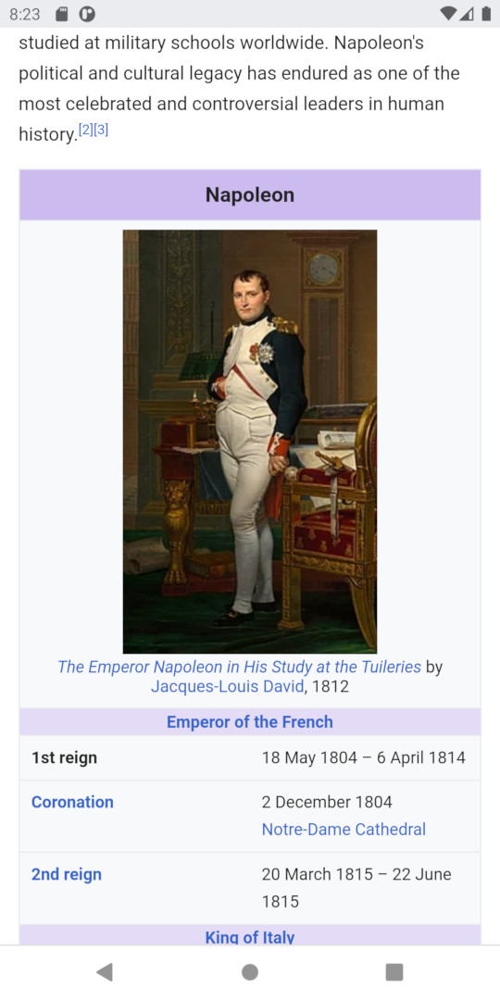
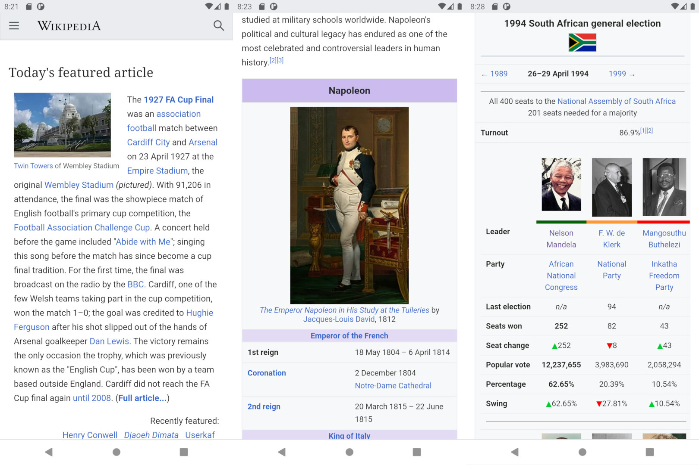

# Stitchy

Joins multiple existing image files into a single output. Supports various flags for
arranging the output or scaling down to desirable dimensions.

Images of the same size will stitch together neatly:

| Input files | | | Output |
| --- | --- | --- | --- |
|  |  |  |  |

If the images are more irregular in shape, the tool will attempt to arrange them
as neatly as possible, and scale some images in the process:

| Input files | | | Output |
| --- | --- | --- | --- |
|  |  |  |  |

### Running

Performed with a simple command that operates on the current directory:

`stitchy n`

where `n` is the number of images you would like to stitch together into one. The tool
will take the `n` most recent files and arrange them in a grid, resizing where needed,
and outputting a file "stitch.jpg".

### Building

This project is a Rust binary project, intended to be used as a command-line tool. No
binaries are distributed, so it must be built from source:

- Install Rust and Cargo if you don't already have them - see the official documentation
  at https://www.rust-lang.org/tools/install to install `rustup` and `cargo` and set up a
  toolchain
- Clone this repository
- Inside the root project directory, run `cargo build --release`
- Suggested - copy the binary created in `./target/release` to somewhere you'd like to keep
  binary tools, and add that location to your path

### Details

- Input files may be in JPEG, PNG, GIF or BMP format, while the output will always be a JPEG
  file named "stitchy.jpg". Operates entirely within the current directory.
- This project has currently only been tested (minimally) on 64-bit Windows using nightly Rust
  and the GNU toolchain, i.e. `nightly-x86_64-pc-windows-gnu`. Testing the MSVC toolchain, as
  well as the GNU toolchain on Linux, is likely to come soon.
